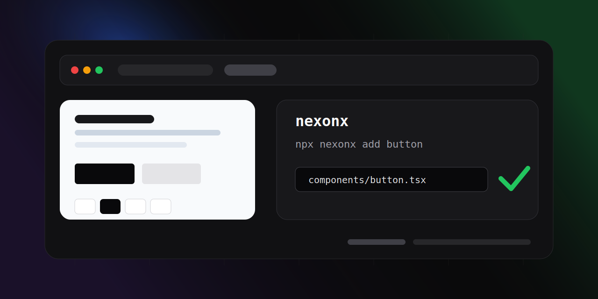

# Nexonx



Copy-ready React components for modern Tailwind apps. Nexonx gives you a tiny CLI that installs the component source directly into your project, so you can own the code, edit it freely, and keep your UI close to your app.

## Why Nexonx?

- **Own your components**: components are copied into your codebase, not hidden inside a package.
- **Tailwind-first**: styles are readable utility classes that are easy to customize.
- **TypeScript-ready**: components ship as `.tsx` files with typed props.
- **Smart setup**: the CLI checks for common dependencies and installs what the selected component needs.
- **Small by design**: start with only the components you ask for.

## Available Components

| Component | Command | What it gives you |
| --- | --- | --- |
| `button` | `npx nexonx add button` | A variant-driven button built with `class-variance-authority` and Radix `Slot` support. |
| `pagination` | `npx nexonx add pagination` | A responsive pagination control with page jumps, limit selection, Lucide icons, and Framer Motion dropdown animation. |

## Quick Start

Run this from the root of your React or Next.js project:

```bash
npx nexonx list
npx nexonx add button
```

You can also add pagination:

```bash
npx nexonx add pagination
```

The CLI copies component files into your project and installs missing packages such as Tailwind, `clsx`, `tailwind-merge`, `@radix-ui/react-slot`, `class-variance-authority`, `lucide-react`, and `framer-motion` when needed.

## Usage

### Button

After running:

```bash
npx nexonx add button
```

Use it in your app:

```tsx
import { Button } from "@/components/button";

export function Example() {
  return (
    <div className="flex gap-3">
      <Button>Get started</Button>
      <Button variant="secondary">Preview</Button>
      <Button variant="outline" size="sm">
        Learn more
      </Button>
    </div>
  );
}
```

Supported variants:

```tsx
<Button variant="default" />
<Button variant="secondary" />
<Button variant="outline" />
<Button variant="ghost" />
<Button variant="destructive" />
```

Supported sizes:

```tsx
<Button size="sm" />
<Button size="md" />
<Button size="lg" />
<Button size="icon" />
```

Use `asChild` when you want the button styles on another element, such as a link:

```tsx
import Link from "next/link";
import { Button } from "@/components/button";

export function LinkButton() {
  return (
    <Button asChild>
      <Link href="/dashboard">Open dashboard</Link>
    </Button>
  );
}
```

### Pagination

After running:

```bash
npx nexonx add pagination
```

Use it with state from your table, list, or API response:

```tsx
import { useState } from "react";
import PaginationBasic from "@/components/pagination";

export function UsersPagination() {
  const [page, setPage] = useState(1);
  const [limit, setLimit] = useState(10);

  const totalCount = 248;
  const totalPages = Math.ceil(totalCount / limit);

  return (
    <PaginationBasic
      totalCount={totalCount}
      limit={limit}
      currentPage={page}
      totalPages={totalPages}
      setLimit={setLimit}
      onPageChange={setPage}
    />
  );
}
```

## CLI Commands

```bash
npx nexonx list
```

Shows every component currently available in the registry.

```bash
npx nexonx add <component>
```

Copies the selected component into your project and prepares required dependencies.

If you install the package globally, the exposed binary is:

```bash
nexonx_cli list
nexonx_cli add button
```

## What Gets Added

For `button`:

```txt
components/button.tsx
lib/utils/cn.tsx
```

For `pagination`:

```txt
components/pagination.tsx
```

The CLI may also create:

```txt
postcss.config.mjs
```

And it may add a Tailwind import to one of these files if it exists:

```txt
app/globals.css
src/app/globals.css
styles/globals.css
```

## Project Structure

```txt
component_lib/
|-- cli/
|   `-- cli.js
|-- components/
|   |-- button.tsx
|   `-- pagination.tsx
|-- lib/
|   `-- utils/
|       `-- cn.tsx
|-- registry/
|   `-- components.json
|-- assets/
|   `-- nexonx-banner.svg
|-- package.json
`-- README.md
```

## Adding A New Component

1. Create the component in `components/`.
2. Add it to `registry/components.json`.
3. Include every file the component needs in the `files` array.
4. Run the CLI from a test app to confirm the files copy correctly.

Example registry entry:

```json
{
  "card": {
    "files": ["components/card.tsx"]
  }
}
```

## Development

Install dependencies:

```bash
npm install
```

List registered components locally:

```bash
node cli/cli.js list
```

Add a component into another project while testing:

```bash
node path/to/component_lib/cli/cli.js add button
```

## Requirements

- React with TypeScript
- Tailwind CSS
- A package manager: npm, pnpm, or yarn

The CLI detects the package manager from lockfiles and falls back to npm.

## License

ISC
